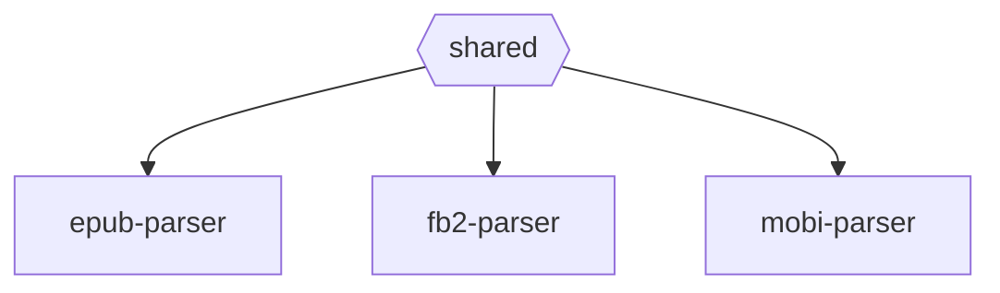

# Contributing Guide

Thanks for lending a hand 👋

## Development

### Setup

- We use [pnpm](https://pnpm.js.org/) to manage dependencies. Install it with `npm i -g pnpm`.
- Install dependencies with `pnpm i`.
- Build all packages with `pnpm run build`.

### Packages Structure

- `shared` contains some shared utils used by `epub-parser`, `fb2-parser` and `mobi-parser`. Including xml2js-parser, path, etc.
- `epub-parser` is the parser of epub file.
- `fb2-parser` is the parser of fb2 file.
- `mobi-parser` is the parser of mobi and azw3(kf8) files.

### Testing

- We use [Vitest](https://vitest.dev) to test the codebase. Run `pnpm run test` to start the test runner.
- We have quite some [Snapshot Tests](https://vitest.dev/guide/snapshot.html) to ensure the output is consistent. If you are making changes to the output, run `pnpm test -u` to update the snapshots.

### Coding conventions

- We use ESLint to lint and format the codebase. Before you commit, all files will be formatted automatically.
- We use [Conventional Commits](https://www.conventionalcommits.org/en/v1.0.0/). Please use a prefix. If your PR has multiple commits and some of them don't follow the Conventional Commits rule, we'll do a squash merge.
